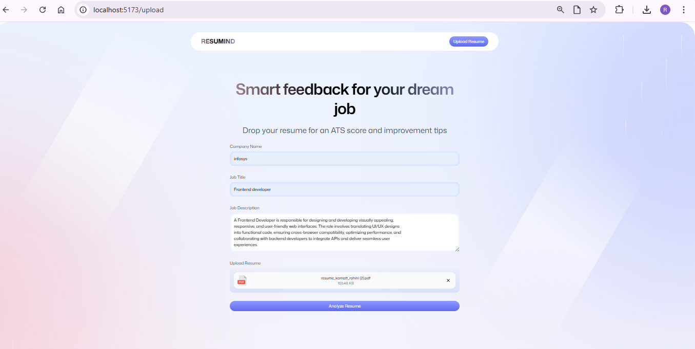
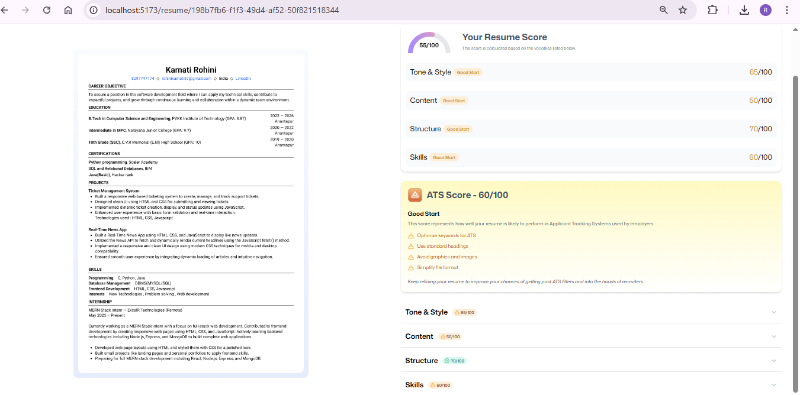

📄 Resumemind — AI-Powered Resume Analyzer

⚡ Resumemind is an AI-powered resume analysis web application that helps users evaluate resumes against job descriptions using ATS-style scoring, keyword matching, and AI insights.
Built with React, TypeScript, Vite, React Router, and AI integrations, it provides instant feedback to improve resume quality and job-fit alignment. 🚀📊

      

🚀 Tech Stack
<table> <tr> <td align="center"> React</td> <td align="center"> TypeScript</td> <td align="center"> Vite</td> <td align="center"> React Router</td> <td align="center"> AI APIs</td> </tr> <tr> <td align="center"> JavaScript</td> <td align="center"> PDF Parsing</td> <td align="center"> Git</td> <td align="center"> NPM</td> <td align="center"> GitHub</td> </tr> </table>

⚙️ Key Features
| Feature                       | Description                                    |
| ----------------------------- | ---------------------------------------------- |
| 📄 **Resume Upload**          | Upload resumes in PDF format for analysis      |
| 🧠 **AI Resume Analysis**     | AI evaluates content, structure, and relevance |
| 📊 **ATS Score**              | Simulates Applicant Tracking System scoring    |
| 🔍 **Keyword Matching**       | Matches resume keywords with job description   |
| 🧾 **Detailed Feedback**      | Actionable suggestions to improve resume       |
| 🧭 **Section-wise Review**    | Skills, experience, education analysis         |
| ⚡ **Fast UI**                 | Built with Vite for high performance           |
| 🔐 **Client-side Processing** | No resume data stored permanently              |

## 📸 Screenshots

### 🏠 Home Page

### 📤 Resume Upload

### 📊 Resume Analysis

🔁 Application Workflow

User Opens Resume Lens
        ↓
Uploads Resume (PDF)
        ↓
Adds Job Description
        ↓
AI Parses Resume Content
        ↓
ATS Score Generated
        ↓
Keyword & Skill Matching
        ↓
AI Feedback & Suggestions
        ↓
User Improves Resume

🧰 Installation & Setup (Local)

1. Clone the repository
 git clone https://github.com/your-username/resume-lens.git
cd resume-lens

3. Install dependencies
npm install

3. Run the development server
npm run dev

4. Open in browser
http://localhost:5173

🚦 Core Pages & Routes
| Route     | Description            |
| --------- | ---------------------- |
| `/`       | Home page              |
| `/upload` | Resume upload          |
| `/resume` | Resume analysis result |
| `/auth`   | Authentication UI      |

🧠 Learning Outcomes

Practical use of React Router with TypeScript

AI-powered text analysis workflows

PDF parsing and content extraction

ATS-style resume evaluation logic

Clean component-based architecture

Modern frontend tooling with Vite

🔗 Connect With Me

   

<h3 align="center"> <em>Made with ❤️ by <strong>Rohini</strong></em> </h3>
